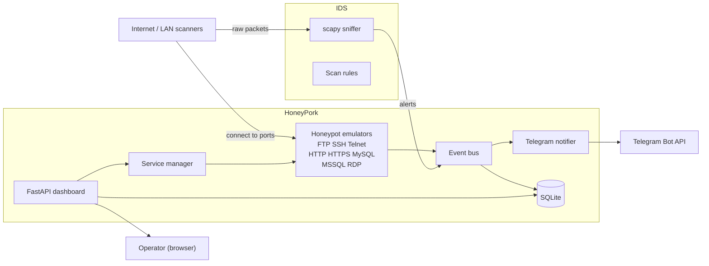
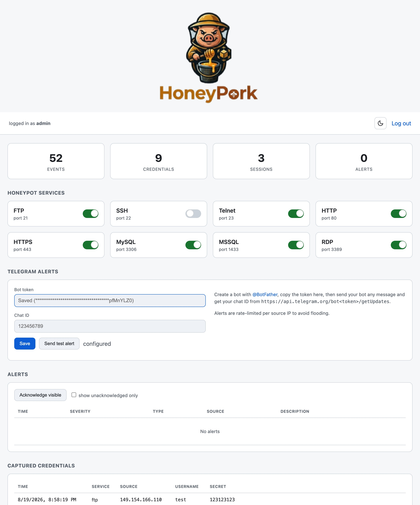

# HoneyPork — Honeypot + IDS

A self-hosted honeypot and intrusion detection system written in Python. It
emulates eight common network services, passively detects network scans, exposes
a web dashboard to toggle services and configure Telegram alerts, and records
every interaction in SQLite.

> **HoneyPork** runs on a single host, accepts connections that look like real
> FTP, SSH, Telnet, HTTP(S), MySQL, MSSQL and RDP services, captures the
> credentials and commands attackers throw at them, and alerts you over Telegram
> while a passive packet sniffer watches for port scans and SYN floods.

<p align="center">
  
</p>

---

## Table of contents

- [Features](#features)
- [Architecture](#architecture)
- [Quick start (Docker)](#quick-start-docker)
- [Native install](#native-install)
- [Configuration](#configuration)
- [Emulated services](#emulated-services)
- [Telegram alerts](#telegram-alerts)
- [Intrusion detection (IDS)](#intrusion-detection-ids)
- [Dashboard](#dashboard)
- [Data model](#data-model)
- [Platform notes](#platform-notes)
- [Security & legal notes](#security--legal-notes)
- [Project layout](#project-layout)
- [License](#license)

---

## Features

- **8 emulated services** — FTP, SSH, Telnet, HTTP, HTTPS, MySQL, MSSQL, RDP
- **Interactive decoys** — fake shells (SSH/Telnet), a decoy file tree (FTP),
  decoy web pages (HTTP/HTTPS), and wire-protocol handshakes (MySQL/MSSQL/RDP)
- **Credential capture** — usernames, plaintext passwords, auth hashes, and SSH
  public keys
- **Command & session capture** — every shell command and session duration
- **IDS** — passive detection of TCP SYN scans, port sweeps, and SYN floods
  (scapy)
- **Telegram alerts** — configurable bot with per-source-IP rate limiting
- **Web dashboard** — authenticated console to toggle services, view live
  events/credentials/alerts, and configure Telegram
- **SQLite** storage, zero-config single file
- **Docker Compose** deployment, with a native (non-Docker) mode

## Architecture



A single async process hosts the emulators, the event bus, and the dashboard
API. The IDS sniffer runs as a separate process (its own container, or a native
command) so it can get raw-socket access to the network.

## Quick start (Docker)

```bash
cp .env.example .env
# edit .env: set ADMIN_PASSWORD and SECRET_KEY (and TELEGRAM_BOT_TOKEN if desired)

docker compose up -d --build
```

Open the dashboard at <http://localhost:8080> and log in with the credentials in
`.env` (default `admin` / `changeme`). The honeypot ports are mapped to the host:

| Service | Port |
| --- | --- |
| FTP | 21 |
| SSH | 22 |
| Telnet | 23 |
| HTTP | 80 |
| HTTPS | 443 |
| MSSQL | 1433 |
| MySQL | 3306 |
| RDP | 3389 |

> **Port conflicts:** if your host already runs a service on one of these ports
> (SSH on 22 is common), change the matching `*_PORT` in `.env` **and** the
> corresponding mapping in `docker-compose.yml`.

### Run the IDS sniffer (Linux)

```bash
docker compose --profile ids up -d ids
```

The sniffer needs `network_mode: host` + `NET_RAW`, which Docker Desktop on
macOS/Windows does not support — see [Platform notes](#platform-notes).

## Native install

Requires Python 3.11+.

```bash
python3 -m venv .venv && source .venv/bin/activate
pip install -r requirements.txt
cp .env.example .env && edit .env
python -m app.main
```

Run the IDS sniffer natively (needs root for raw sockets):

```bash
sudo python -m app.ids.sniffer
```

## Configuration

All settings are read from environment variables / a `.env` file (see
[`.env.example`](.env.example)). Runtime toggles (services, Telegram) are also
stored in the SQLite `settings` table and editable from the dashboard.

| Variable | Default | Description |
| --- | --- | --- |
| `DASHBOARD_HOST` | `0.0.0.0` | Dashboard bind address |
| `DASHBOARD_PORT` | `8080` | Dashboard port |
| `DASHBOARD_TLS` | `false` | Serve the dashboard over TLS |
| `ADMIN_USERNAME` | `admin` | Dashboard login username |
| `ADMIN_PASSWORD` | `changeme` | Dashboard login password (bcrypt-hashed on first run) |
| `SECRET_KEY` | — | Session cookie signing key — **change this** |
| `DATA_DIR` | `data` | Directory for the DB, certs and decoy files |
| `DB_FILENAME` | `honeypork.db` | SQLite database file name |
| `HONEYPOT_HOST` | `0.0.0.0` | Bind address for all honeypots |
| `FTP_ENABLED` … `RDP_ENABLED` | `true` | Per-service enable flag |
| `FTP_PORT` … `RDP_PORT` | — | Per-service listen port |
| `IDS_ENABLED` | `false` | Start the sniffer inside the main process |
| `IDS_INTERFACE` | — | Network interface to sniff (blank = default) |
| `SCAN_WINDOW_SECONDS` | `30` | Sliding window for scan detection |
| `SCAN_PORT_THRESHOLD` | `8` | Distinct ports per window to flag a port scan |
| `SYN_FLOOD_THRESHOLD` | `100` | SYNs per window to flag a SYN flood |
| `TELEGRAM_BOT_TOKEN` | — | Telegram bot token |
| `TELEGRAM_CHAT_ID` | — | Telegram chat ID |
| `TELEGRAM_NOTIFY_CONNECTION` | `true` | Alert on new connections |
| `TELEGRAM_NOTIFY_CREDENTIAL` | `true` | Alert on captured credentials |
| `TELEGRAM_NOTIFY_SCAN` | `true` | Alert on scan/attack detection |
| `TELEGRAM_COOLDOWN_SECONDS` | `60` | Per-source-IP alert cooldown |

## Emulated services

| Service | Library | What it does |
| --- | --- | --- |
| **SSH** | `asyncssh` | Banner + password/key auth capture; drops into a fake shell that records every command and returns decoy output |
| **Telnet** | `telnetlib3` | Login prompt capture + fake shell |
| **FTP** | `pyftpdlib` | Anonymous/user+pass capture; serves a decoy file tree |
| **HTTP** | `aiohttp` | Decoy pages; captures form/POST credentials, paths, and user-agents |
| **HTTPS** | `aiohttp` + `cryptography` | Same as HTTP over a self-signed cert |
| **MySQL** | hand-rolled wire protocol | `mysql_native_password` handshake; captures username + auth hash |
| **MSSQL** | hand-rolled TDS | Pre-login + `LOGIN7`; captures username + deobfuscated password |
| **RDP** | hand-rolled X.224/MCS | Connection + negotiation; best-effort client metadata capture |

The decoy content (fake files, command outputs, web pages, banners) lives in
[`app/honeypots/decoy.py`](app/honeypots/decoy.py) and is easy to customize.

## Telegram alerts

1. Create a bot with [@BotFather](https://t.me/BotFather) and copy its token.
2. Send the bot any message, then open
   `https://api.telegram.org/bot<TOKEN>/getUpdates` and copy your chat ID.
3. Enter both in the dashboard (or `.env`) and click **Send test alert**.

Alerts are sent for new connections, captured credentials, and detected
scans — each rate-limited per source IP (`TELEGRAM_COOLDOWN_SECONDS`) to prevent
flooding during a sweep.

## Intrusion detection (IDS)

The sniffer (`app/ids/sniffer.py`) captures TCP SYN packets with scapy and feeds
them into a sliding-window detector (`app/ids/rules.py`) that flags:

- **Port scan** — one source hitting `SCAN_PORT_THRESHOLD` distinct ports in a
  window
- **SYN flood** — one source sending `SYN_FLOOD_THRESHOLD` SYNs in a window

Detected events are written to the `alerts` table and pushed to Telegram.

## Dashboard

The dashboard (FastAPI + Jinja2 + vanilla JS/CSS) provides:

- **Login** — bcrypt-hashed credentials with a signed session cookie
- **Service grid** — toggle each of the 8 services on/off (applied live and
  persisted)
- **Telegram panel** — set bot token + chat ID, send a test alert
- **Alerts** — list, filter unacknowledged, acknowledge
- **Credentials** — captured usernames/passwords/hashes
- **Events** — full connection/request/command log
- **Stats** — counts of events, credentials, sessions, and alerts

<p align="center">
  
</p>

API endpoints (all require an authenticated session):

| Method | Path | Purpose |
| --- | --- | --- |
| `GET` | `/api/stats` | Stats + service status |
| `GET` | `/api/events` | Event feed |
| `GET` | `/api/credentials` | Captured credentials |
| `GET` | `/api/alerts` | Alerts (`?unacked=true` to filter) |
| `POST` | `/api/alerts/{id}/ack` | Acknowledge an alert |
| `POST` | `/api/services/{name}/toggle` | Enable/disable a service |
| `GET`/`POST` | `/api/settings/telegram` | Read/update Telegram config |
| `POST` | `/api/telegram/test` | Send a test alert |

## Data model

SQLite tables (see [`app/db/queries.py`](app/db/queries.py)):

- **events** — timestamp, source IP/port, dest port, service, event type, details (JSON)
- **credentials** — timestamp, source IP, service, username, secret, extra (JSON)
- **sessions** — timestamp, source IP, service, duration, commands (JSON)
- **alerts** — timestamp, severity, type, source IP, description, acknowledged
- **settings** — key/value store (service toggles, Telegram config)

## Platform notes

- **Linux server/VPS (recommended)** — full functionality, including passive
  scan detection via host networking:
  `docker compose --profile ids up -d`.
- **macOS / Windows (Docker Desktop)** — the honeypot container works via port
  mapping, but the *passive* sniffer cannot see host traffic through the Docker
  VM. Run the sniffer natively instead: `sudo python -m app.ids.sniffer`.

## Security & legal notes

- Only run this on systems and networks **you own or are explicitly authorized
  to monitor**. Honeypots attract real malicious traffic and log real
  credentials/commands.
- This is a security tool, **not** a production service. It intentionally accepts
  attacker connections and never exposes real data.
- The RDP emulator is **best-effort**: it completes the X.224/MCS negotiation and
  captures client metadata, but does not implement full NTLM/CredSSP credential
  capture.
- Change `ADMIN_PASSWORD` and `SECRET_KEY` before exposing the dashboard to any
  network.
- Self-signed certificates are generated automatically for the HTTPS honeypot.

## Project layout

```
HoneyPork/
├── docker-compose.yml     # app + optional ids service
├── Dockerfile
├── requirements.txt
├── .env.example
├── app/
│   ├── main.py            # entrypoint: dashboard + honeypots + optional IDS
│   ├── config.py          # pydantic settings
│   ├── db/                # SQLite connection + schema
│   ├── core/              # event bus, service manager, geo helper
│   ├── honeypots/         # base + 8 emulators + decoy content
│   ├── ids/               # scapy sniffer + detection rules
│   ├── notifier/          # Telegram client
│   ├── dashboard/         # FastAPI app, auth, templates, static
│   └── utils/             # self-signed cert generation
├── data/                  # runtime: SQLite DB, certs, decoy files (gitignored)
└── tests/                 # smoke tests
```

## License

Provided as-is for research, education, and authorized defensive use. You are
responsible for complying with applicable laws in your jurisdiction.
